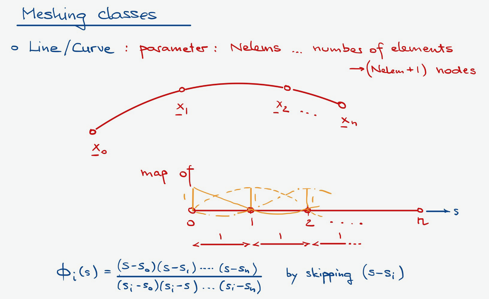
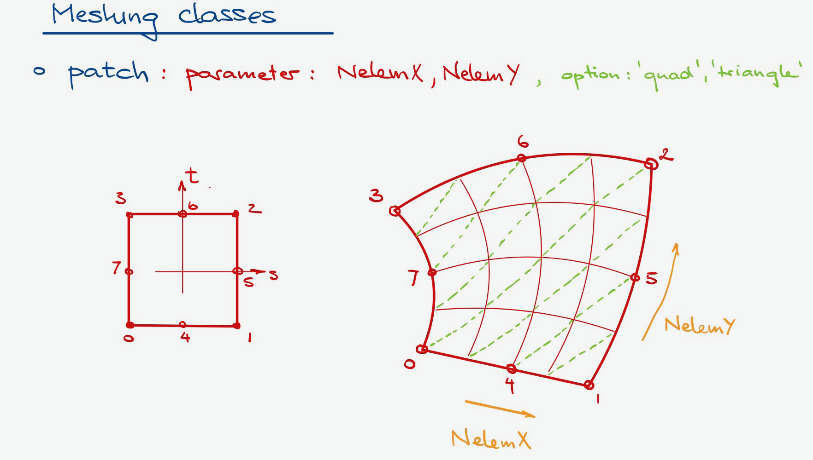
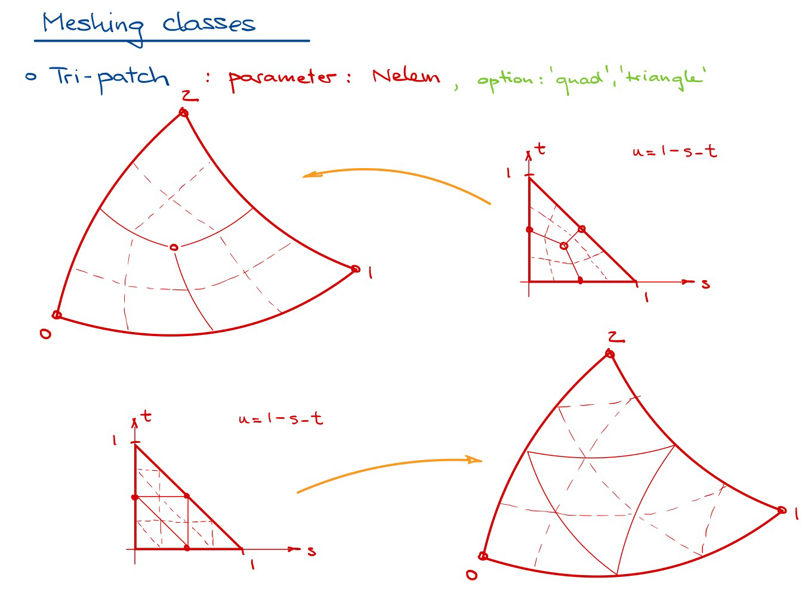

Mesh Generators
=================

Generating a finite element mesh can be a taunting task, especially when mesh refinements
are needed.  |PackageName| attempts to simplify that task using a series of :py:class:`Mesher` sub-classes
that allow you to mesh a geometric region based on the shape of a super-domain and mesh refinement parameters.

.. note::

    Meshers are currently under development but not yet available with the distribution.
    Stay tuned for updates.

Meshers shall be developed for the following geometric elements.

Lines and Curves
--------------------

For beams and frame components.

    Meshing along a curve.

Quadrilateral domains
------------------------

For plate and shell elements, including in-plane and out-of plane loaded plates.

    Meshing a quadrilateral patch with quadrilaterals or triangles.

Triangular domains
--------------------

For plate and shell elements, including in-plane and out-of plane loaded plates.

    Meshing a triangular patch with quadrilaterals or triangles.

3D Solid domains
--------------------

For 8-node, 20-node, and 27-node brick elements.

.. figure:: ./images/solid.png
    :alt: ./images/solid.png
    :align: center

    Meshing a solid with brick elements.
