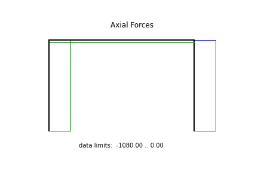
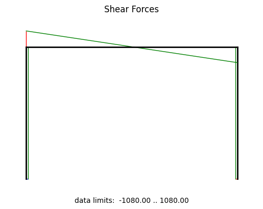
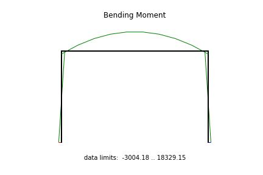

Example: frame03
==================

.. figure:: frame3_deformed.png
    :align: center

    system and deformation

.. figure:: frame3_buckling_mode0.png
    :align: center

    buckling mode shape

**Importing the example**

.. code:: python

    from femedu.examples.frames.frame03 import *

    # load the example
    ex = ExampleFrame03()

**More frame examples**: :doc:`../../frame_examples`
