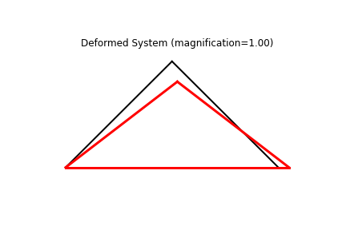
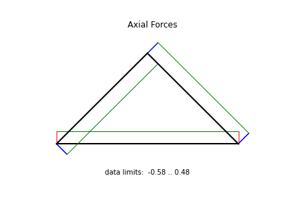

Example: truss01
==================

We build the model based a few parameters as follows.

.. literalinclude:: ../../../../../src/femedu/examples/trusses/truss01.py
   :lineno-start: 1
   :lines: 26-29

All mesh creation is based solely on the above parameters to allow for easy
manipulation of the model.

The actual model is built by the block below.

.. literalinclude:: ../../../../../src/femedu/examples/trusses/truss01.py
   :lineno-start: 5
   :lines: 31-51

Line 5 instantiates one model space.

Lines 8-10 create the nodes, and
lines 12 adds them to the model space.

Lines 14-17 create the elements and simultaneously adds them to the model space.
You only need to create variables for `Node` and `Element` objects, respectively,
if you need to either add or retrieve information from that object later.

Lines 19-21 define the support conditions by providing the respective information
directly to the supported nodes.

Lines 23-25 applies the reference load(s) as a nodal force at `nd2`.

The system equations are solved by a single call to the solver:

.. literalinclude:: ../../../../../src/femedu/examples/trusses/truss01.py
   :lineno-start: 30
   :lines: 53-54

You can obtain a debug-style report on the state of the system:

.. literalinclude:: ../../../../../src/femedu/examples/trusses/truss01.py
   :lineno-start: 32
   :lines: 56-57

Resulting in an output like (may change as the code evolves).

    .. code-block:: text

        System Analysis Report
        =======================

        Nodes:
        ---------------------
          Node 0: {'ux': 0, 'uy': 1}
                  x:[0. 0.], fix:['ux', 'uy'],
                  P:[0. 0.], u:[0. 0.]
          Node 1: {'ux': 0, 'uy': 1}
                  x:[72.  0.], fix:['uy', 'ux'],
                  P:[0. 0.], u:[0. 0.]
          Node 2: {'ux': 0, 'uy': 1}
                  x:[36. 36.], fix:[],
                  P:[ 0. -1.], u:[ 0.         -5.09116882]

        Elements:
        ---------------------
          Truss: node 0 to node 1:
             material properties: FiberMaterial(Material)({'E': 10.0, 'A': 1.0, 'nu': 0.0, 'fy': 1e+30})  strain:0.0   stress:{'xx': 0.0, 'yy': 0.0, 'zz': 0.0, 'xy': 0.0}
             internal force: 0.0
             Pe: [ 0.0 0.0 ]
          Truss: node 0 to node 2:
             material properties: FiberMaterial(Material)({'E': 10.0, 'A': 1.0, 'nu': 0.0, 'fy': 1e+30})  strain:-0.06989658167930027   stress:{'xx': -0.6989658167930026, 'yy': 0.0, 'zz': 0.0, 'xy': 0.0}
             internal force: -0.6989658167930026
             Pe: [ -0.530317996923979 -0.4553197065619366 ]
          Truss: node 1 to node 2:
             material properties: FiberMaterial(Material)({'E': 10.0, 'A': 1.0, 'nu': 0.0, 'fy': 1e+30})  strain:-0.06989658167930027   stress:{'xx': -0.6989658167930026, 'yy': 0.0, 'zz': 0.0, 'xy': 0.0}
             internal force: -0.6989658167930026
             Pe: [ 0.530317996923979 -0.4553197065619366 ]

An easier way to look at the simulation results are plots.  A deformed system plot is obtained
using the `model.plot()` directive.  If a `filename` is given, the plot will be saved
to the harddrive using that file name.
An internal force plot is created equally simple.

.. literalinclude:: ../../../../../src/femedu/examples/trusses/truss01.py
   :lineno-start: 34
   :lines: 59-61

    Showing file *truss01_deformed.png*

    Showing file *truss01_forces.png*

**Importing the example**

.. code:: python

    from femedu.examples.trusses.truss01 import *

    # load the example
    ex = ExampleTruss01()

**More truss examples**: :doc:`../../truss_examples`
