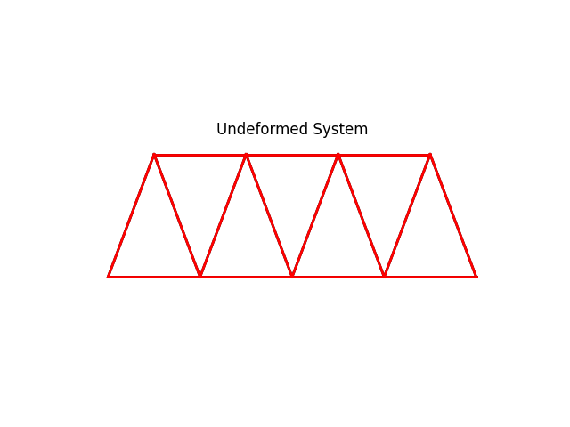
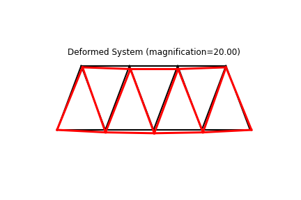
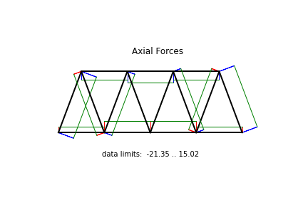

Example: truss02
==================

    System and deformed shape

We build the model based a few parameters as follows.

.. literalinclude:: ../../../../../src/femedu/examples/trusses/truss02.py
   :lineno-start: 1
   :lines: 27-33

All mesh creation is based solely on the above parameters to allow for easy
manipulation of the model.

The actual model is built by the block below.

.. literalinclude:: ../../../../../src/femedu/examples/trusses/truss02.py
   :lineno-start: 8
   :lines: 35-80

Line 8 instantiates one model space.

Line 9 switches from the default linear solver to the :py:class:`NewtonRaphsonSolver`, needed for nonlinear problems.

Lines 11-20 create the nodes, and
line 22 adds them to the model space.

Lines 24-42 create the elements and simultaneously adds them to the model space.
You only need to create variables for `Node` and `Element` objects, respectively,
if you need to either add or retrieve information from that object later.

Lines 44-46 define the support conditions by providing the respective information
directly to the supported nodes.

Lines 48-53 applies the reference load(s) as a nodal force at `nd2`.

The system equations are solved by a single call to the solver:

.. literalinclude:: ../../../../../src/femedu/examples/trusses/truss02.py
   :lineno-start: 54
   :lines: 84-85

You can obtain a debug-style report on the state of the system:

.. literalinclude:: ../../../../../src/femedu/examples/trusses/truss02.py
   :lineno-start: 56
   :lines: 87-88

Resulting in an output like (may change as the code evolves).

    .. code-block:: text

        System Analysis Report
        =======================

        Nodes:
        ---------------------
          Node_0:
              x:    [0. 0.]
              fix:  ['ux', 'uy']
              u:    [0. 0.]
          Node_1:
              x:    [72.  0.]
              u:    [ 0.0175857  -0.18448191]
          Node_2:
              x:    [144.   0.]
              u:    [ 0.05359577 -0.25049274]

        [ ... ]

        Elements:
        ---------------------
          Truss: node 0 to node 1:
             material properties: FiberMaterial(Material)({'E': 10000.0, 'A': 3.0, 'nu': 0.0, 'fy': 1e+30})  strain:0.00025074648384184977   stress:{'xx': 2.5074648384184974, 'yy': 0.0, 'zz': 0.0, 'xy': 0.0}
             internal force: 7.522394515255492
             Pe: [ 7.522369834729211 -0.01926947591183249 ]
          Truss: node 1 to node 2:
             material properties: FiberMaterial(Material)({'E': 10000.0, 'A': 3.0, 'nu': 0.0, 'fy': 1e+30})  strain:0.0005007291419303546   stress:{'xx': 5.007291419303546, 'yy': 0.0, 'zz': 0.0, 'xy': 0.0}
             internal force: 15.021874257910639
             Pe: [ 15.021867950880157 -0.013765420367433319 ]
          Truss: node 2 to node 3:
             material properties: FiberMaterial(Material)({'E': 10000.0, 'A': 3.0, 'nu': 0.0, 'fy': 1e+30})  strain:0.0005007291419303549   stress:{'xx': 5.00729141930355, 'yy': 0.0, 'zz': 0.0, 'xy': 0.0}
             internal force: 15.02187425791065
             Pe: [ 15.021867950880168 0.01376542036743333 ]

        [ ... ]

An easier way to look at the simulation results are plots.  A deformed system plot is obtained
using the `model.plot()` directive.  If a `filename` is given, the plot will be saved
to the harddrive using that file name.
An internal force plot is created equally simple.

.. literalinclude:: ../../../../../src/femedu/examples/trusses/truss02.py
   :lineno-start: 58
   :lines: 90-92

    System and deformed shape

    Axial force diagram

**Importing the example**

.. code:: python

    from femedu.examples.trusses.truss02 import *

    # load the example
    ex = ExampleTruss02()

**More truss examples**: :doc:`../../truss_examples`
