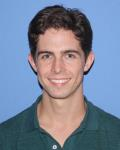

^^^^^^^^^^^^^^^^^^^^^^^^^^^^^
About the Developers
^^^^^^^^^^^^^^^^^^^^^^^^^^^^^

.. list-table::
    :class: borderless
    :width: 95
    :widths: 30 70

    * - |PeterMH|
      - **Peter Mackenzie-Helnwein**

            |
            | Research Associate Professor
            | Dept. of Civil and Environmental Engineering
            | University of Washington, Seattle, United States
            |
            | Lead developer

    * - |TatsuS|
      - **Tatsuhiko Sweet**

            |
            | Ph.D. candidate
            | University of Washington, Seattle, United States

    * - |BillG|
      - **William Galik**

            |
            | Ph.D. candidate
            | University of Padua, Italy

    * - |JordanS|
      - **Jordan Seawright**

            |
            | Graduate, Ph.D. (2023)
            | University of Washington, Seattle, United States

.. |PeterMH| image:: ../images/peter-mackenzie-helnwein.jpeg
    :alt: image of Peter
    :scale: 50 %

.. |TatsuS| image:: ../images/tatsu-sweet.jpeg
    :alt: image of Tatsu
    :scale: 100 %

