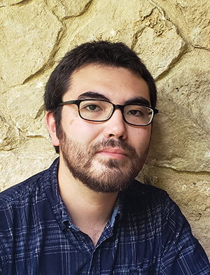
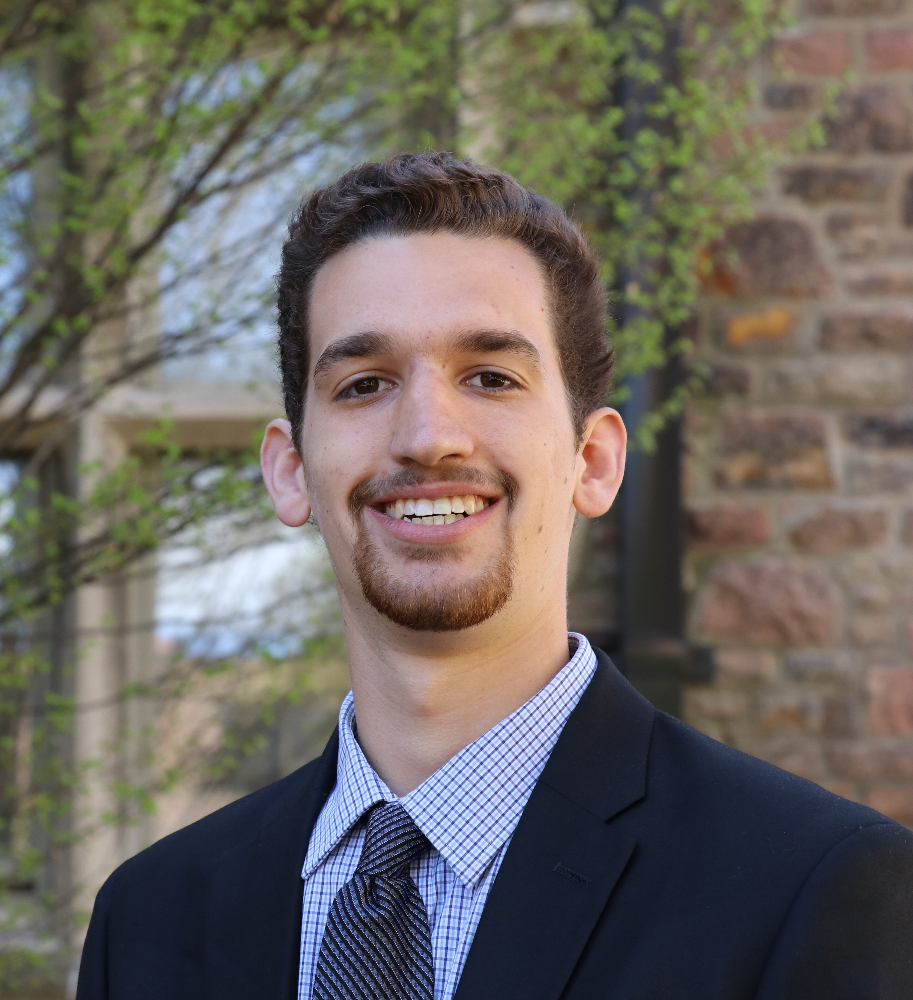
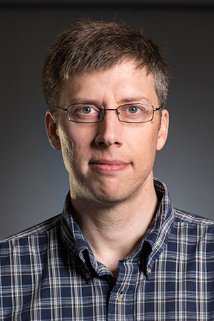

^^^^^^^^^^^^^^^^^^^^^^^^^^^^^
About the Developers
^^^^^^^^^^^^^^^^^^^^^^^^^^^^^

Release Series 1.1.*
=======================

.. list-table::
    :class: borderless
    :width: 95
    :widths: 30 70

    * - |PeterMH|
      - **Peter Mackenzie-Helnwein**

            |
            | Research Associate Professor
            | Dept. of Civil and Environmental Engineering
            | University of Washington, Seattle, United States
            |
            | Lead developer

Release Series 1.0.*
=======================

.. list-table::
    :class: borderless
    :width: 95
    :widths: 30 70

    * - |PeterMH|
      - **Peter Mackenzie-Helnwein**

            |
            | Research Associate Professor
            | Dept. of Civil and Environmental Engineering
            | University of Washington, Seattle, United States
            |
            | Lead developer

    * - |TatsuS|
      - **Tatsuhiko Sweet**

            |
            | Ph.D. candidate
            | University of Washington, Seattle, United States

    * - |BillG|
      - **William Galik**

            |
            | Ph.D. candidate
            | IUSS Pavia, Italy

    * - |JordanS|
      - **Jordan Seawright**

            |
            | Graduate, Ph.D. (2023)
            | University of Washington, Seattle, United States

Credits
==========================

Special thanks for great discussions in aid of the development process goes to:

.. list-table::
    :class: borderless
    :width: 95
    :widths: 30 70

    * - |PedroA|
      - **Pedro Arduino**

            |
            | Professor
            | Dept. of Civil and Environmental Engineering
            | University of Washington, Seattle, United States
            |
            | Material Models, Geotechnical Applications

    * - |RichardW|
      - **Richard Wiebe**

            |
            | Associate Professor
            | Dept. of Civil and Environmental Engineering
            | University of Washington, Seattle, United States
            |
            | Educational components, Structural Stability

    * -
      - **Ewan Steers**

            |
            | Graduate Student in CEE @ UW, Seattle
            |
            | Thank you for improving the mapping of gauss point data to nodes.

.. |PeterMH| image:: ../images/peter-mackenzie-helnwein.jpeg
    :alt: image of Peter
    :width: 150

.. |PedroA| image:: ../images/pedro-arduino.jpeg
    :alt: image of Pedro
    :width: 150

