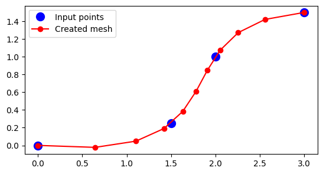

CurveMesher class
==========================

Meshing of beams and frame components along a curve.

.. code:: python

    model = System()
    mesher = CurveMesher(model, (0,0),(1.5,.25),(2,1),(3.,1.5))
    mesher.mesh(10, Frame2D, ElasticSection())

    Meshing a curve with 2-noded elements.

Parent class
--------------

* :doc:`Mesher_class`

Class doc
----------

.. automodule:: femedu.mesher.CurveMesher
  :members:

