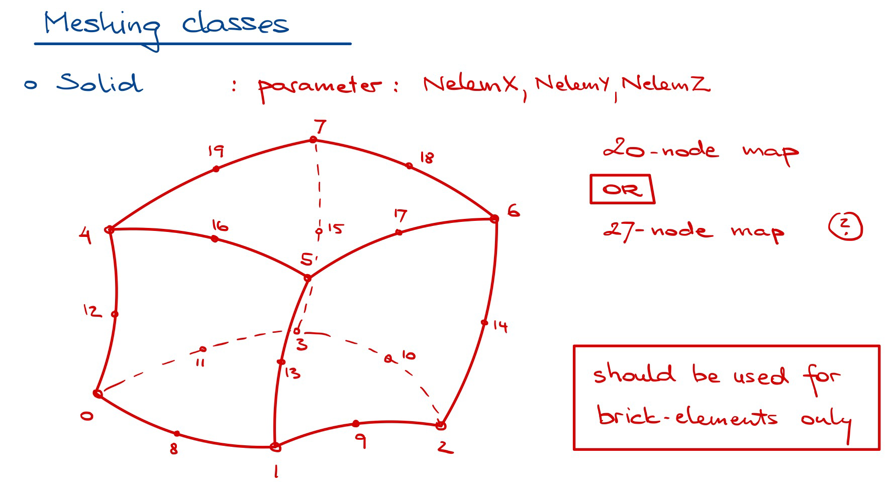

SolidMesher class
==========================

For 8-node, 20-node, and 27-node brick elements.

    Meshing a solid domain with brick elements.

.. note::

    Meshers are currently under development but not yet available with the distribution.
    Stay tuned for updates.

Parent class
--------------

* :doc:`Mesher_class`

Class doc
----------

.. automodule:: femedu.mesher.SolidMesher
  :members:

