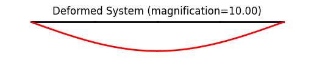
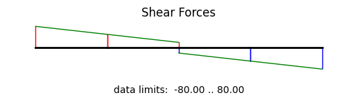

Example: beam01
==================

We build the model based a few parameters as follows.

.. literalinclude:: ../../../../../src/femedu/examples/beams/beam01.py
   :lineno-start: 1
   :lines: 26-32

All mesh creation is based solely on the above parameters to allow for easy
manipulation of the model.

The actual model is built by the block below.

.. literalinclude:: ../../../../../src/femedu/examples/beams/beam01.py
   :lineno-start: 8
   :lines: 34-68

Line 8 instantiates one model space.

Lines 16, 25-27 create the nodes, and
lines 17 and 28 add them to the model space.

Lines 34-36 create the elements and  add them to the model space.
You only need to create variables for `Node` and `Element` objects, respectively,
if you need to either add or retrieve information from that object later.

The support conditions are defined by providing the respective information
directly to the supported nodes.
The following lines add a pin support on the first node and a roller on the last one.

.. literalinclude:: ../../../../../src/femedu/examples/beams/beam01.py
   :lineno-start: 43
   :lines: 70-72

We still need to apply the point load at the center node.
In the above element creation loop, we identified the node closest to the center node (will be exactly at the center
if `Nelem` is an even number) and stored it as `ndP`.
Apply the  nodal force at `ndP` by the next lines to complete the model.

.. literalinclude:: ../../../../../src/femedu/examples/beams/beam01.py
   :lineno-start: 46
   :lines: 74-77

The system equations are solved by a single call to the solver:

.. literalinclude:: ../../../../../src/femedu/examples/beams/beam01.py
   :lineno-start: 50
   :lines: 79-80

You can obtain a debug-style report on the state of the system:

.. literalinclude:: ../../../../../src/femedu/examples/beams/beam01.py
   :lineno-start: 52
   :lines: 82-83

Resulting in an output like (may change as the code evolves).

    .. code-block:: text

        System Analysis Report
        =======================

        Nodes:
        ---------------------
          Node 0: {'uy': 0, 'rz': 1}
                  x:[0. 0.], fix:['ux', 'uy'],
                  P:[0. 0.], u:[ 0.         -0.03615668]
          Node 1: {'uy': 0, 'rz': 1}
                  x:[30.  0.], fix:[],
                  P:[0. 0.], u:[-0.97547707 -0.02561098]
          Node 2: {'uy': 0, 'rz': 1}
                  x:[60.  0.], fix:[],
                  P:[-40.   0.], u:[-1.38600603e+00 -1.37017950e-17]
          Node 3: {'uy': 0, 'rz': 1}
                  x:[90.  0.], fix:[],
                  P:[0. 0.], u:[-0.97547707  0.02561098]
          Node 4: {'uy': 0, 'rz': 1}
                  x:[120.   0.], fix:['uy'],
                  P:[0. 0.], u:[0.         0.03615668]

        Elements:
        ---------------------
          Beam2D: node 0 to node 1:
             material ElasticSection properties: {'E': 29000.0, 'A': 4.7, 'I': 103, 'nu': 0.0, 'fy': 1e+30}  strain:{'axial': 0.0, 'flexure': 0.0}   stress:{'axial': 0.0, 'flexure': 0.0}
             nodal forces: Vi:65.0 Mi:-74.99999999999909 Vj:-65.0 Mj:2024.999999999989
          Beam2D: node 1 to node 2:
             material ElasticSection properties: {'E': 29000.0, 'A': 4.7, 'I': 103, 'nu': 0.0, 'fy': 1e+30}  strain:{'axial': 0.0, 'flexure': 0.0}   stress:{'axial': 0.0, 'flexure': 0.0}
             nodal forces: Vi:34.999999999999886 Mi:-2024.9999999999864 Vj:-34.999999999999886 Mj:3074.999999999981
          Beam2D: node 2 to node 3:
             material ElasticSection properties: {'E': 29000.0, 'A': 4.7, 'I': 103, 'nu': 0.0, 'fy': 1e+30}  strain:{'axial': 0.0, 'flexure': 0.0}   stress:{'axial': 0.0, 'flexure': 0.0}
             nodal forces: Vi:-34.999999999999716 Mi:-3074.99999999998 Vj:34.999999999999716 Mj:2024.9999999999936
          Beam2D: node 3 to node 4:
             material ElasticSection properties: {'E': 29000.0, 'A': 4.7, 'I': 103, 'nu': 0.0, 'fy': 1e+30}  strain:{'axial': 0.0, 'flexure': 0.0}   stress:{'axial': 0.0, 'flexure': 0.0}
             nodal forces: Vi:-65.00000000000023 Mi:-2024.9999999999936 Vj:65.00000000000023 Mj:74.99999999999818

An easier way to look at the simulation results are plots.  A deformed system plot is obtained
using the `model.plot()` directive.  If a `filename` is given, the plot will be saved
to the harddrive using that file name.
An internal force plot is created equally simple.

.. literalinclude:: ../../../../../src/femedu/examples/beams/beam01.py
   :lineno-start: 54
   :lines: 85-89

    Showing file *beam01_deformed.png*

    Showing file *beam01_shear.png*

.. figure:: beam01_moment.png
    :align: center

    Showing file *beam01_moment.png*

**Importing the example**

.. code:: python

    from femedu.examples.beams.beam01 import *

    # load the example
    ex = ExampleBeam01()

**More beam examples**: :doc:`../../beam_examples`
