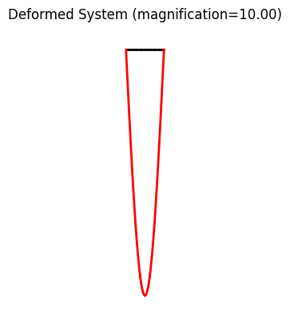
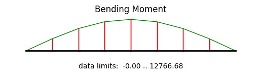

Example: frame01
==================

    system and deformation

.. figure:: frame1_force.png
    :align: center

.. figure:: frame1_shear.png
    :align: center

.. figure:: frame1_buckling_mode0.png
    :align: center

    buckling mode shape

**Importing the example**

.. code:: python

    from femedu.examples.frames.frame01 import *

    # load the example
    ex = ExampleFrame01()

**More frame examples**: :doc:`../../frame_examples`
