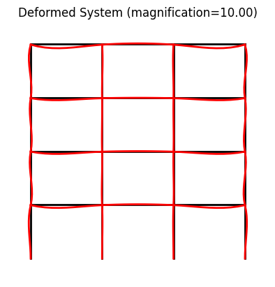
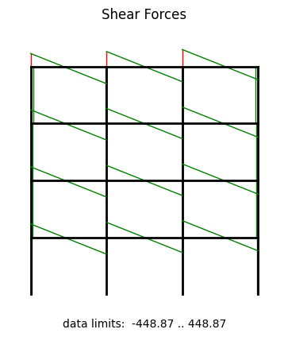
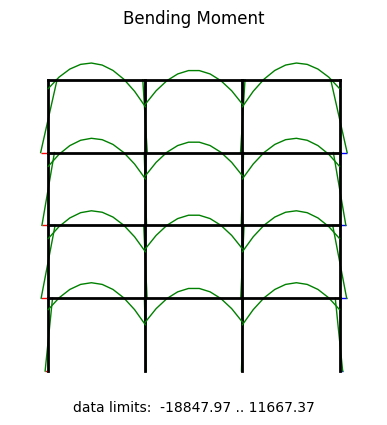
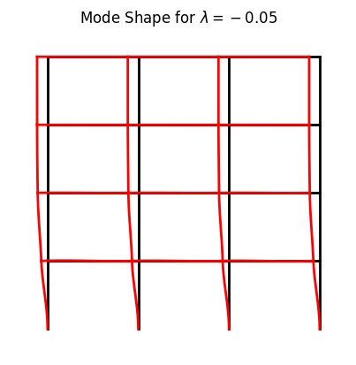
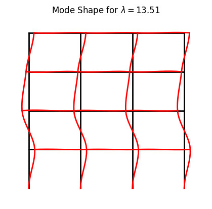
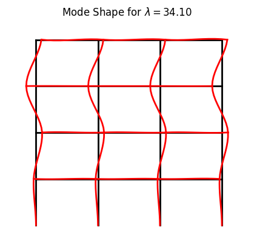

Example: frame04
==================

    system and deformation

.. figure:: frame4_force.png
    :align: center

    first buckling mode shape

.. figure:: frame4_buckling_mode1.png
    :align: center

    second buckling mode shape

    third buckling mode shape

    fourth buckling mode shape

**Importing the example**

.. code:: python

    from femedu.examples.frames.frame04 import *

    # load the example
    ex = ExampleFrame04()

**More frame examples**: :doc:`../../frame_examples`
