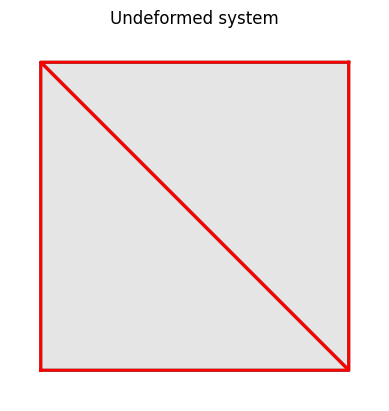

Example: plate01
==================

    Initial system and meshing for the patch test.

We build the model based a few parameters as follows.

.. literalinclude:: ../../../../../src/femedu/examples/plates/plate01.py
   :lineno-start: 1
   :lines: 64-72

All mesh creation is based solely on the above parameters to allow for easy
manipulation of the model.

The actual model is built by the block below.

.. literalinclude:: ../../../../../src/femedu/examples/plates/plate01.py
   :lineno-start: 10
   :lines: 74-90

Line 9 instantiates one model space.

Lines 11-14 create the nodes, and
lines 16 adds them to the model space.

Lines 18-19 create the elements and line 21 adds them to the model space.
You only need to create variables for `Node` and `Element` objects, respectively,
if you need to either add or retrieve information from that object later.

Line 23 adds a surface load to face 2 of element :py:obj:`elemB`. See :doc:`../../../implementation/Elements/Triangle_class`
for the definition of faces for this element.

Set the load factor to 1.00 to activate and check element loads,
and prescribe all degrees of freedom to eliminate the need for solving
the system equations.

.. literalinclude:: ../../../../../src/femedu/examples/plates/plate01.py
   :lineno-start: 27
   :lines: 92-97

Force the elements to update their state of strain and stress based on the prescribed
nodal displacements and generate a report.

.. literalinclude:: ../../../../../src/femedu/examples/plates/plate01.py
   :lineno-start: 32
   :lines: 99-102

Here the generated report (release: 3/12/2023):

    .. code::

        System Analysis Report
        =======================

        Nodes:
        ---------------------
          Node_0:
              x:    [0. 0.]
              u:    [0. 0.]
          Node_1:
              x:    [10.  0.]
              u:    [5. 0.]
          Node_2:
              x:    [10. 10.]
              u:    [ 5. -5.]
          Node_3:
              x:    [ 0. 10.]
              u:    [ 0. -5.]

        Elements:
        ---------------------
          LinearTriangle: nodes ( Node_0 Node_1 Node_3 )
              material: PlaneStress
              strain: xx=6.250e-01 yy=-3.750e-01 xy=0.000e+00 zz=-7.500e-02
              stress: xx=5.632e+00 yy=-2.060e+00 xy=0.000e+00 zz=0.000e+00
          LinearTriangle: nodes ( Node_2 Node_3 Node_1 )
              material: PlaneStress
              strain: xx=6.250e-01 yy=-3.750e-01 xy=0.000e+00 zz=-7.500e-02
              stress: xx=5.632e+00 yy=-2.060e+00 xy=0.000e+00 zz=0.000e+00
              element forces added to node:
                  Node_2: [5. 0.]
                  Node_3: [0. 0.]
                  Node_1: [5. 0.]

.. figure:: plate01_deformed.png
    :align: center

    Deformed system at load level 1.00

**Importing the example**

.. code:: python

    from femedu.examples.plates.plate01 import *

    # load the example
    ex = ExamplePlate01()

**More frame examples**: :doc:`../../plate_examples`
