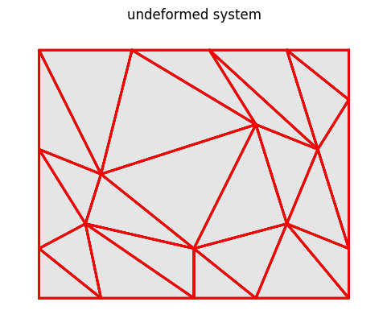
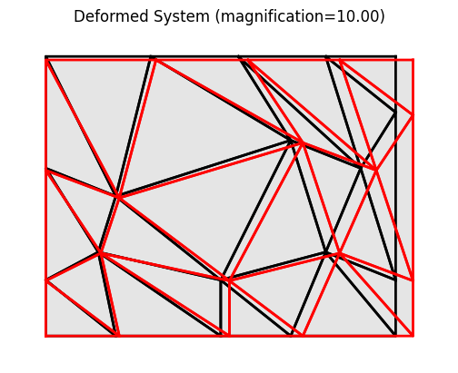

Example: plate03
==================

    Initial system and meshing for the patch test.

We build the model based a few parameters as follows.

.. literalinclude:: ../../../../../src/femedu/examples/plates/plate03.py
   :lineno-start: 1
   :lines: 32-58

Lines 26-27 define the list of target load levels for the nonlinear analysis.
For the patch test, we actually need only a single non-zero load level, though more may be used for other purposes.

All mesh creation is based solely on the above parameters to allow for easy
manipulation of the model.

The actual model is built by the block below.

.. literalinclude:: ../../../../../src/femedu/examples/plates/plate03.py
   :lineno-start: 28
   :lines: 60-128

Line 32 instantiates one model space.

Line 33 switches from the default linear solver to the :py:class:`NewtonRaphsonSolver`, needed for nonlinear problems.

Lines 37-61 create the nodes,
lines 63-93 create the elements
and
lines 95-96 adds them to the model space.

The patch test should be entirely load controlled and kinematic constraints shall be set to the absolute minimum:
*preventing a rigid body mode without ever imposing any constraints on deformation.*
The following lines represent such a minimum support.

.. literalinclude:: ../../../../../src/femedu/examples/plates/plate03.py
   :lineno-start: 97
   :lines: 130-138

The load is applied as an equilibrium group, i.e., such that they do not generate any support reactions.
A uniform horizontal tension is applied using surface loads.

.. literalinclude:: ../../../../../src/femedu/examples/plates/plate03.py
   :lineno-start: 106
   :lines: 142-150

See :doc:`../plate02/plate02` for another, simpler example, and :doc:`../../../implementation/Elements/Triangle_class` for the definition of faces for this element.

The actual computation is as simple as a single call to the solver:

.. literalinclude:: ../../../../../src/femedu/examples/plates/plate03.py
   :lineno-start: 115
   :lines: 160-161

You can obtain a debug-style report on the state of the system:

.. literalinclude:: ../../../../../src/femedu/examples/plates/plate03.py
   :lineno-start: 117
   :lines: 163

The report will look something like this:

    .. code::

        System Analysis Report
        =======================

        Nodes:
        ---------------------
          Node_0:
              x:    [0. 0.]
              fix:  ['ux', 'uy']
              u:    [0. 0.]
          Node_1:
              x:    [20.  0.]
              u:    [9.92598389e-02 3.57659354e-16]
          Node_2:
              x:    [50.  0.]
              u:    [2.48149597e-01 7.56113665e-16]

        [ ... ]

        Elements:
        ---------------------
          LinearTriangle: nodes ( Node_0 Node_1 Node_5 )
              material: PlaneStress
              strain: xx=4.975e-03 yy=-1.244e-03 xy=-6.038e-17 zz=-9.329e-04
              stress: xx=9.951e+01 yy=2.959e-12 xy=-4.830e-13 zz=0.000e+00
              element forces added to node:
                  Node_0: [-800.    0.]
                  Node_1: [0. 0.]
                  Node_5: [-800.    0.]
          LinearTriangle: nodes ( Node_1 Node_2 Node_6 )
              material: PlaneStress
              strain: xx=4.975e-03 yy=-1.244e-03 xy=-7.754e-17 zz=-9.329e-04
              stress: xx=9.951e+01 yy=1.776e-12 xy=-6.203e-13 zz=0.000e+00
          LinearTriangle: nodes ( Node_2 Node_3 Node_7 )
              material: PlaneStress
              strain: xx=4.975e-03 yy=-1.244e-03 xy=2.659e-16 zz=-9.329e-04
              stress: xx=9.951e+01 yy=6.516e-12 xy=2.127e-12 zz=0.000e+00

        [ ... ]

A visual check, however, is usually more convenient.

.. literalinclude:: ../../../../../src/femedu/examples/plates/plate03.py
   :lineno-start: 118
   :lines: 165

    Deformed system at load level 1.00

**Importing the example**

.. code:: python

    from femedu.examples.plates.plate03 import *

    # load the example
    ex = ExamplePlate03()

**More frame examples**: :doc:`../../plate_examples`
